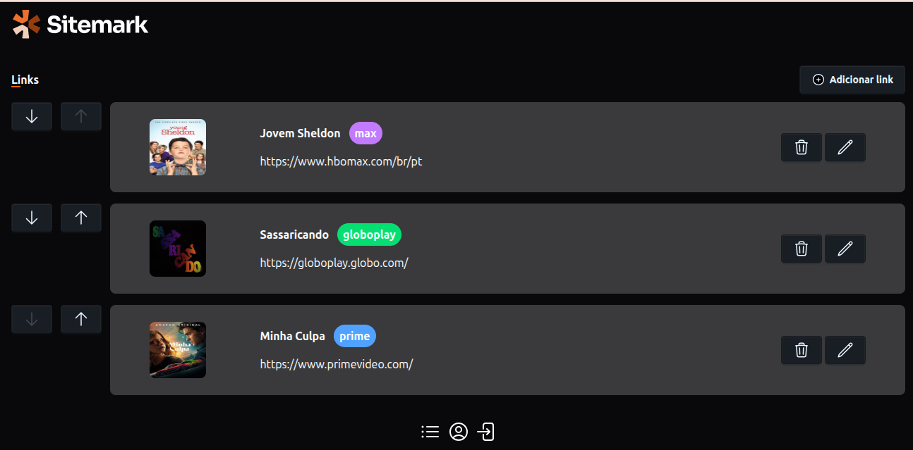

# 💼 Portfolio Dev - Desafio Rocketseat PHP

Este projeto é o **quarto desafio** do Curso de Formação PHP da [Rocketseat](https://www.rocketseat.com.br/).
Organizador de Links em PHP com o framework **Laravel** com **Tailwind CSS** e **DaisyUi**, uma aplicação onde os usuários podem salvar e gerenciar links de conteúdos que desejam assistir em plataformas de streaming, como séries, filmes e shows.



---

## 🚀 Como rodar localmente

````bash
# Clone este repositório
git clone https://github.com/anacnogueira/sitemark.git

# Acesse a pasta do projeto
cd sitemark

# Instale as dependências:
 ```composer install
    ```
# Copie o arquivo .env.example para .env e configure as variáveis de ambiente (banco de dados, email, etc):

    ```
    cp .env.example .env
    ```

#. Gere a chave da aplicação:
    ```
    php artisan key:generate
    ```
#. Inicie o docker com sail:

    ```
    sail up -d
    ```
Depois, abra o navegador em:
👉 [http://localhost](http://localhost)

---

## 🧰 Tecnologias usadas

- **PHP 8.5**
- **Tailwind CSS**
- ** DAisy UI**
- ** Laravel 13**
- Docker
- Nginx
- Sqlite

---


## 📸 Seções do Sistema

- Registar Usuário
- Login
- Dashboard
- Listar Links
- Incluir Link
- Editar Link
- Excluir Link
- Ordenar Links
- Editar Perfil usuário

---


Feito com 💖 por [@anacnogueira] (https://github.com/anacnogueira)
```
````
